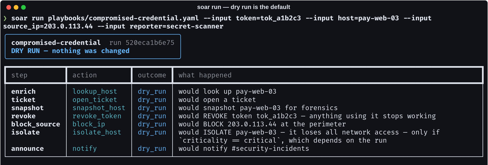
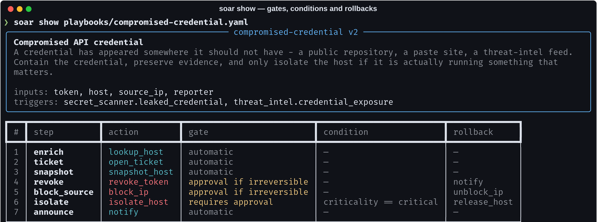
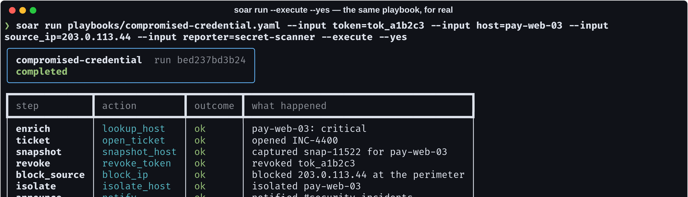
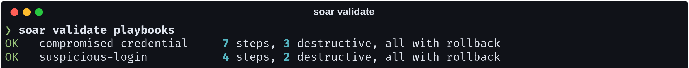
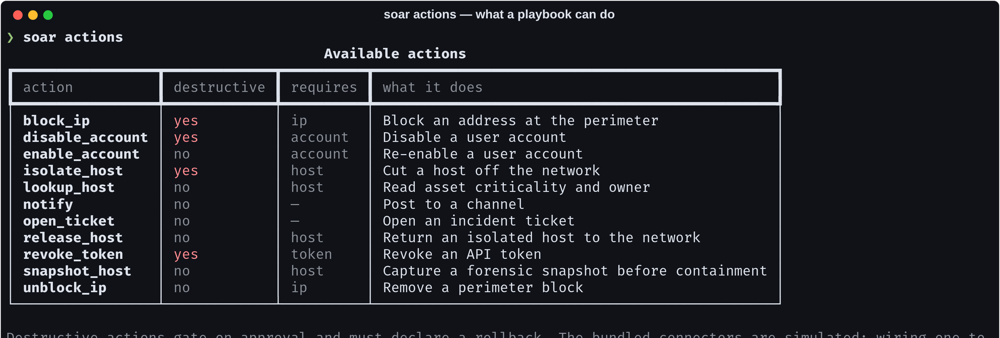

# playbook-automator

> A SOAR that defaults to doing nothing. `run` shows you what it *would* do and
> changes nothing until you add `--execute` — because a response tool whose
> default is to act gets run once by accident and distrusted permanently
> afterwards.

[](https://github.com/Vincent-P-essy/playbook-automator/actions/workflows/ci.yml)
[](pyproject.toml)
[](tests)
[](src/soar/engine.py)
[](LICENSE)

Incident-response playbooks in YAML, executed with the guardrails that decide
whether anyone trusts them at 03:00: approval on irreversible steps, idempotency
by key, automatic rollback in reverse on failure, and a record of every step
whether it ran or not.



Note the `isolate` row. Its condition depends on a value an earlier step
produces, so a dry run cannot honestly say whether it would run — and it says
so, naming the condition, rather than guessing.

## The three properties that matter

**Every destructive step declares how to undo it.** A step whose action is
destructive and which declares no rollback **fails validation**. Isolating the
wrong host during an incident turns one problem into two, and the person
undoing it at 03:15 is the one who was already having a bad night.

**Every step is idempotent by key.** The key comes from the resolved
parameters, not from the run — so a second attempt after a timeout recognises
the first attempt's work. Keying on the run id would make every retry a fresh
execution, which is precisely the bug.

**Approval is a property of the step.** "Ask before doing anything" gets
clicked through. "Ask before this specific irreversible action, showing exactly
what it will do and how it would be undone" gets read.



## The same playbook, for real



Failure walks back in **reverse order**, automatically:

```
revoke        revoke_token  ok            revoked tok_a1b2c3
block_source  block_ip      ok            blocked 203.0.113.44
isolate       isolate_host  failed        connector timed out
block_source:rollback  unblock_ip   rolled_back  unblocked 203.0.113.44
revoke:rollback        notify       rolled_back  posted to #security
```

Two details that matter more than the mechanism:

- **Steps that reported `already_done` are not rolled back.** Undoing work this
  run did not do is how a rollback causes its own incident.
- **Rollback failures are recorded, never raised.** A rollback that aborts
  halfway leaves the estate in a state nobody chose *and* nobody knows about.

## Writing a playbook

```yaml
id: compromised-credential
inputs: [token, host, source_ip, reporter]

steps:
  - id: enrich
    action: lookup_host          # read-only: no gate, no rollback needed
    params: { host: "{host}" }
    approval: never
    bind: { criticality: criticality }

  - id: snapshot
    action: snapshot_host
    description: >-
      Forensics before containment. Isolation can trigger cleanup routines
      and destroy the evidence of how the credential leaked.
    params: { host: "{host}" }

  - id: isolate
    action: isolate_host
    when: "criticality == critical"    # not for a wiki server
    params: { host: "{host}" }
    approval: always
    rollback:
      action: release_host
      params: { host: "{host}" }
```

`soar validate` catches, before an incident rather than during one:

- a destructive step with no rollback
- an action that is not registered, listing the ones that are
- a required parameter that is missing
- **a placeholder nothing will ever fill** — the commonest playbook bug, where
  a run reaches production and blocks the literal IP address `{source_ip}`
- a destructive step set to run unattended (allowed, but say so deliberately)



## Conditions are not Python

```python
evaluate("criticality == critical", context)
evaluate("distance_km > 5000", context)
evaluate("tag not in tags", context)
```

Deliberately a small expression evaluator rather than `eval`. A playbook is
configuration, frequently written by someone who is not the person reviewing
the code that runs it — a condition that can execute arbitrary Python is a
remote code execution waiting for a pull request.

## Connectors



Every connector declares whether it is **destructive**: whether its effect
outlives the run and someone would have to undo it deliberately. That single
flag drives approval gating, rollback validation, and what a dry run prints.

The bundled connectors are simulated, with the state a real one has to reason
about — isolating an already-isolated host reports `already_done`, revoking an
unknown token *refuses* rather than claiming success. Wiring `isolate_host` to
a real EDR is the handler function and a credential. Everything around it — the
gate, the key, the rollback, the record — is the part that is actually hard, and
the part usually missing.

## Resuming a failed run

```bash
soar run playbook.yaml --input host=web-01 --execute --out run.json
# ... it fails at step 5 ...
soar run playbook.yaml --input host=web-01 --execute --resume run.json
```

Completed steps are skipped **and their bound values replayed** into the
context. Skipping without replaying was a real bug here: the resume succeeded
at the skipped step and then failed at the next one, referring to a value
nothing had produced. There is a test named after it.

## Install and run

```bash
git clone https://github.com/Vincent-P-essy/playbook-automator
cd playbook-automator
pip install -e .

soar validate playbooks
soar show     playbooks/compromised-credential.yaml
soar run      playbooks/compromised-credential.yaml \
              --input token=tok_a1b2c3 --input host=pay-web-03 \
              --input source_ip=203.0.113.44 --input reporter=secret-scanner
```

Add `--execute` to act. Without a TTY and without `--yes`, gated steps are
**denied** rather than auto-approved — an unattended run must not quietly grant
itself permission.

## Where this stops

- **Steps run in order, in one process.** No fan-out, no parallelism. Response
  playbooks are short and ordering usually matters; a DAG engine would add more
  failure modes than it removes.
- **The bundled connectors are simulated.** The engine is the product.
- **Rollback is best effort.** If the undo action also fails, that is recorded
  and a human is needed. Nothing can make an unreliable API reliable.
- **No scheduler and no queue.** Trigger it from your SIEM's webhook, or from
  cron. Owning the trigger surface would make it a platform rather than a tool.

## Layout

```
src/soar/
  playbook.py        the YAML schema and its validation
  engine.py          dry run, approval, idempotency, rollback, the record
  connectors/        the action registry, plus simulated connectors with state
  cli.py             run · validate · show · actions
playbooks/           compromised-credential · suspicious-login
```

## Licence

MIT
